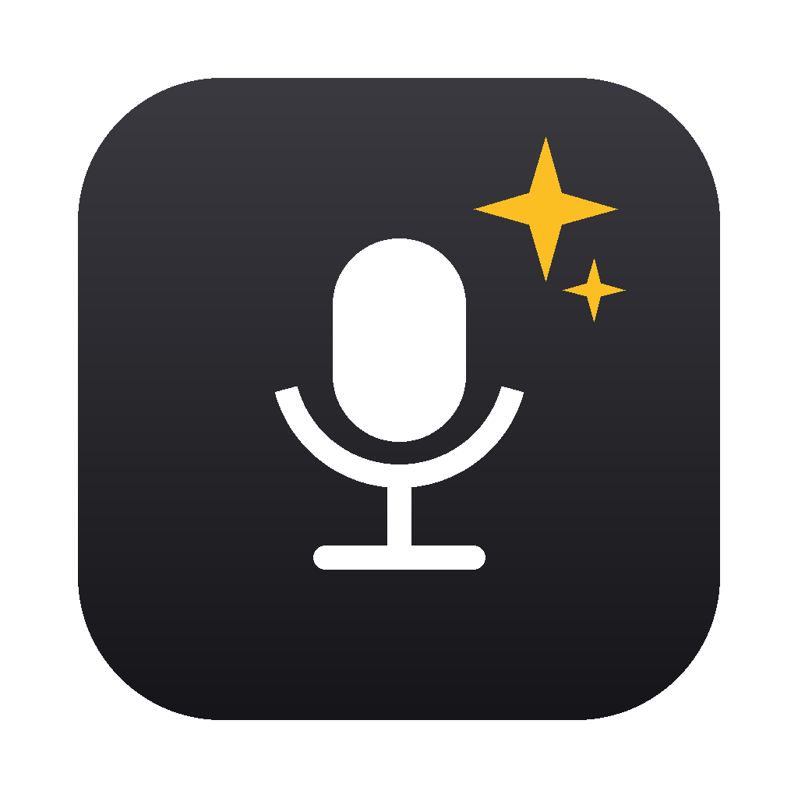

<p align="center">
  
</p>

# abra

> *abracadabra* — from the Aramaic **avra kehdabra**: "I create as I speak."

Local push-to-talk dictation for macOS. **Hold Fn, speak, release** — clean
text appears wherever your cursor is. Everything runs on-device: nothing you
say ever leaves your Mac.

- **Fast** — NVIDIA Parakeet on Apple's MLX; a few seconds of speech
  transcribes in ~250ms on Apple Silicon
- **Private** — no cloud, no accounts, no telemetry; audio and transcripts
  stay in a local folder you own
- **Personal dictionary** — phrase rules fix *your* recurring mishears
  ("come in and push" → "commit and push"); add yours in `vocab.local.toml`
- **Native** — menu bar app, hold-Fn (or right Option) hotkey,
  launch at login; mic indicator only lights while you're actually recording
- **Yours to inspect** — every dictation is logged to a local SQLite corpus
  with timing metadata, which doubles as a benchmark suite for comparing
  STT models on your own voice

## Install

```bash
brew install ramsrib/tap/abra
open /Applications/Abra.app
```

That's it — the cask installs the app (signed & notarized), its dependencies,
and the transcription engine. Grant the permission prompts (Microphone, then
Accessibility and Input Monitoring — all attributed to "abra"), wait out the
one-time model download (~700MB, menu bar icon shows an hourglass), then hold
**Fn** and talk. The menu bar icon has *Launch at Login* and a *Hotkey*
picker (Fn, right ⌥, or right ⌘). Holding the hotkey while pressing any
other key — Fn+arrows, ⌘ shortcuts — is left alone: combos pass through,
no recording, no sound.

Updates: `brew upgrade abra` — the app and engine move together, pinned to
each release.

Requires an Apple Silicon Mac on macOS 13+.

### From source (development)

```bash
git clone https://github.com/ramsrib/abra && cd abra
uv sync           # engine deps (needs uv + ffmpeg: brew install uv ffmpeg)
make app          # build, sign, install /Applications/Abra.app
make run          # or: terminal-only Python shell (hold right Option)
```

## How it works

```
hold key ──▶ mic capture ──▶ local STT ──▶ personal dictionary ──▶ paste at cursor
```

The load-bearing decision (see `ARCHITECTURE.md`): a **permanent Python
engine** (STT, dictionary, corpus, keep-warm) behind a small JSON protocol,
with **replaceable shells** — a Swift menu bar app and a Python terminal
shell today. Features live in the engine and survive shell rewrites.

- `abra/engine/` — STT → dictionary → (future: LLM cleanup); SQLite corpus;
  `abra-engine` protocol server
- `abra/shell/` — Python shell: pynput hotkey, mic, tones, paste
- `shells/mac/` — Swift menu bar shell (hold-Fn, the daily driver)
- `vocab.toml` / `vocab.local.toml` — dictionary rules (shared / yours)
- `EXPERIMENTS.md` — the experiment backlog this project runs on

## Your data

Every dictation stores its wav + metadata (timings, model, audio levels,
transcript) in `clips/` — local, gitignored, yours. It exists so you can
hand-correct transcripts into ground truth and benchmark engines against
your own voice (`make stats` for a quick look). Delete it anytime.

## Prior art

[VoiceInk](https://github.com/Beingpax/VoiceInk) ·
[Handy](https://github.com/cjpais/Handy) — different takes on the same idea,
both worth reading.

## License

MIT
